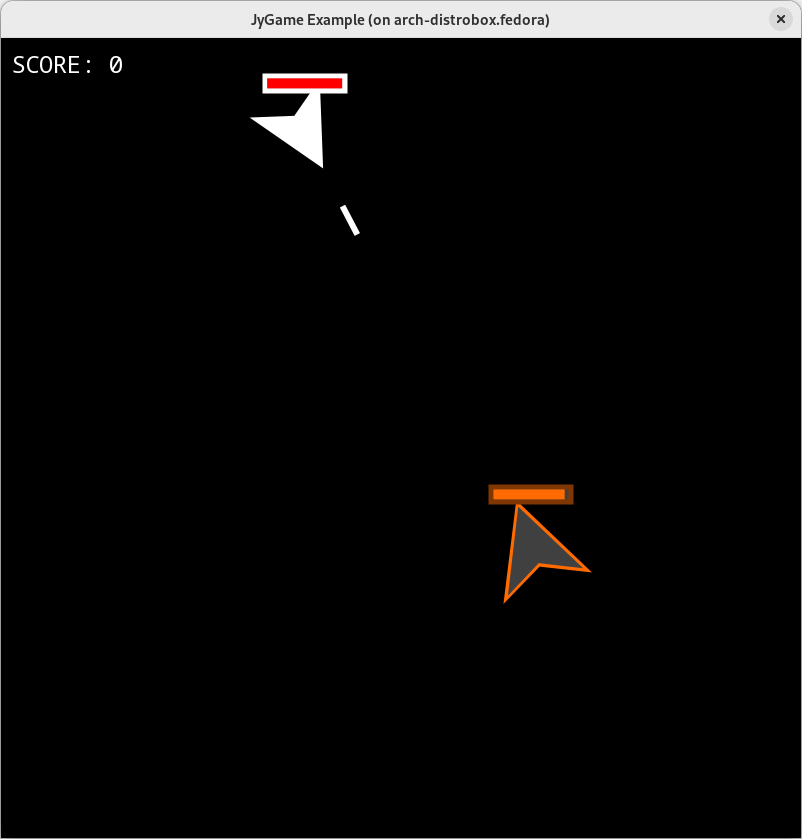

# JyGame-Example
  
An example game utilizing the [JyGame](https://github.com/pastthepixels/JyGame) library.

## How do I run it?
1. Go to the Releases tab and download the .jar
2. Run `java -jar jygame_example-1.0-full.jar`

## How do I compile it?
1. Install JyGame to your computer either via something something GitHub Packages or following the instructions in its README
2. Clone this repository
3. Run `mvn clean compile assembly:single`
